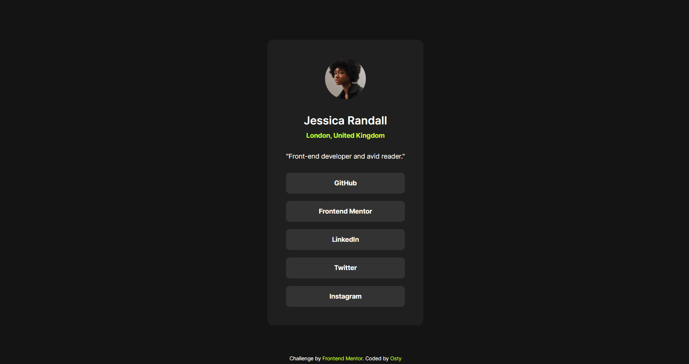

# Frontend Mentor - Social links profile solution

This is a solution to the [Social links profile challenge on Frontend Mentor](https://frontendmentor.io). Frontend Mentor challenges help you improve your coding skills by building realistic projects.

## Table of contents
- [Overview](#overview)
  - [The challenge](#the-challenge)
  - [Screenshot](#screenshot)
  - [Links](#links)
- [My process](#my-process)
  - [Built with](#built-with)
  - [What I learned](#what-i-learned)
  - [Continued development](#continued-development)
- [Author](#author)

## Overview

### The challenge
Users should be able to:
- See hover and focus states for all interactive elements on the page (specifically all social media links).
- Navigate through all links seamlessly using only a keyboard.
- View the optimal layout depending on their device's screen size.

### Screenshot
  
*Fig 1. Final look of my responsive web card implementation with fluid typography and keyboard navigation support.*

### Links
- Solution URL: [https://github.com](https://github.com/Osty-trainee/Social-links-profile)
- Live Site URL: [https://github.io](https://osty-trainee.github.io/Social-links-profile/)

## My process

### Built with
- Semantic HTML5 markup (including `<main>`, `<nav>`, and `<footer>` tags for accessibility)
- CSS custom properties (variables for design system and spacing guide)
- CSS Flexbox (for clean component grouping and layout alignment)
- Fluid container sizing using the CSS `clamp()` function

### What I learned
During this project, I ran into a few real-world frontend challenges and learned how to overcome them without using legacy hacks:

1. **Accessibility (A11y):** To ensure keyboard users can interact with the component, I utilized native `<a>` tags inside navigation structures and styled them using the `:focus-visible` pseudo-class. This provides a highly visible focus state with precise `outline` offsets.
2. **Local Font Injection:** I had issues with network blocking when fetching Google Fonts via external URLs, resulting in terminal errors. I solved this by downloading the Inter files locally into a `/fonts` folder and configuring them via `@font-face` with proper weights matching the Figma file.
3. **Optimizing Spacing without Margin Soup:** Originally, I mixed margins and gap properties, which led to duplicate layout spacing. I refactored the CSS to rely strictly on a unified `gap` strategy inside the flex parent, making the stylesheet incredibly concise.

Below is the code snippet I am most proud of:

```css
/* Responsive, bulletproof card container with explicit system-wide spacing vars */
.card {
    display: flex;
    flex-direction: column;
    background-color: var(--color-grey-800);
    padding: var(--space-400);
    width: clamp(327px, 100%, 384px);
    border-radius: var(--space-150);
    text-align: center;
    gap: var(--space-300);
}
```

## Continued development
In my upcoming projects, I want to focus on:
- Transitioning entirely from pixel-based sizing (px) to relative units (rem/em) for better default zoom experiences.
- Implementing complex layouts using CSS Grid alongside Flexbox.
- Exploring deeper aria-attributes to push semantic accessibility even further.

## Author

- GitHub - [@Osty-trainee](https://github.com/Osty-trainee)
- Frontend Mentor - [@Osty-trainee](https://www.frontendmentor.io/profile/Osty-trainee)
